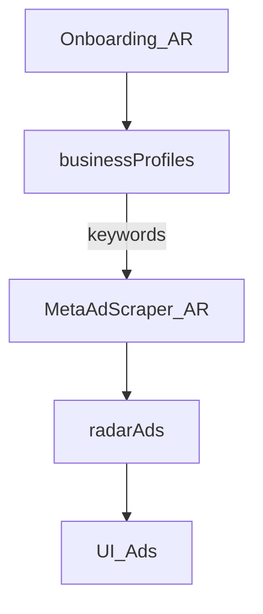

# TrendOS — Contexto de producto

Fuente de verdad de **qué problema resuelve** TrendOS y cómo se mapea al código.

## 1. Problema y promesa

Cualquier persona que quiera montar un ecommerce (o ya tenga uno) necesita responder: **¿qué productos vender?**

TrendOS ayuda a encontrar **productos que ya se están anunciando** en Meta en Argentina — con onboarding simple y un explorador de anuncios.

| Incluido (MVP) | Fuera de alcance (por ahora) |
|---|---|
| Onboarding conversacional (AR) | Otros países |
| Explorador de anuncios Meta (scrape) | Ads Manager / creativos del usuario |
| Perfil de nicho para filtrar | Creador de tiendas TN/Shopify |
| | Pipeline de “agentes” / Radar Score UI |

## 2. Flujo

1. Onboarding: goal, canales, keywords
2. Worker scrape Ad Library `country=AR`
3. UI `/ads` muestra creativos filtrados por nicho

## 3. Datos

- `businessProfiles` — goal, channels, nicheKeywords, existingStoreUrl
- `radarAds` / `radarAdvertisers` / `radarStores` — índice Meta AR
- Mercado Libre / Gemini / SerpAPI **no** están en el path caliente del MVP

## 4. Scrape

Ver `scripts/meta-ad-scraper/` y `META_ADS_INGEST_SECRET`.
La API oficial Meta Ad Library **no cubre** ads comerciales en AR; por eso scrapeamos la web pública (logged-out, rate-limited).
