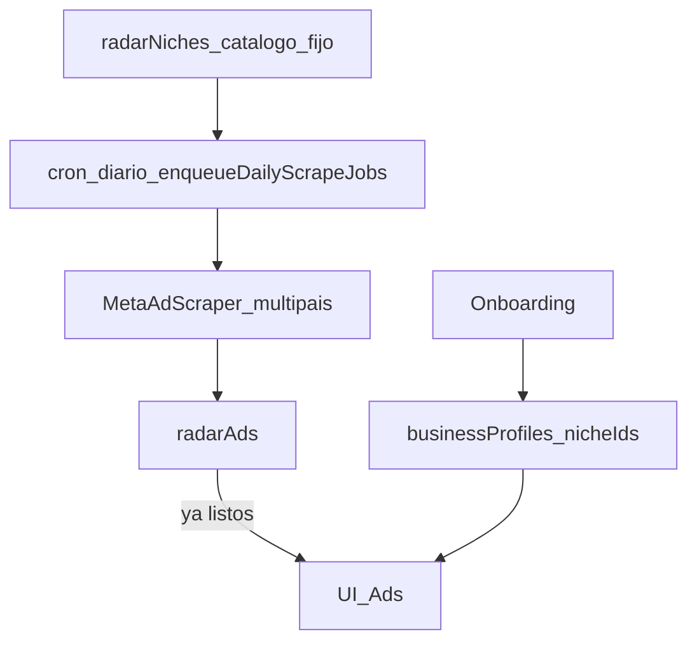

# TrendOS — Contexto de producto

Fuente de verdad de **qué problema resuelve** TrendOS y cómo se mapea al código.

## 1. Problema y promesa

Cualquier persona que quiera montar un ecommerce (o ya tenga uno) necesita responder: **¿qué productos vender?**

TrendOS ayuda a encontrar **productos que ya se están anunciando** en Meta — con onboarding simple (elegir un nicho de un catálogo fijo, ya pre-scrapeado) y un explorador de anuncios. La investigación de proveedores/Mercado Libre sigue siendo específica de Argentina — es el diferencial frente a herramientas de ad-intelligence globales (gethookd y similares) que no cubren AR ni matching local.

| Incluido (MVP) | Fuera de alcance (por ahora) |
|---|---|
| Onboarding: elegir nicho de un catálogo fijo curado | Keywords tipeadas / niches dinámicos por usuario |
| Explorador de anuncios Meta, pre-scrapeados (AR, US, BR, MX, ES) | Ads Manager / creativos del usuario |
| Investigar producto → matching Mercado Libre + proveedores (AR-específico) | Creador de tiendas TN/Shopify |
| | Pipeline de “agentes” / Radar Score UI |

## 2. Flujo

1. El catálogo de nichos (curado, ver `convex/admin/seedNicheCatalog.ts`) se scrapea solo: un cron diario encola un job por (nicho, país); un worker GitHub Actions los procesa continuamente.
2. Onboarding: goal, canales, elegir 1 nicho (Free) o hasta 3 (Pro) del catálogo — sin esperar un scrape, los ads ya existen.
3. UI `/ads` muestra el pool de ads de los nichos elegidos, ya filtrados por el pase de relevancia compartido.

## 3. Datos

- `businessProfiles` — goal, channels, `nicheIds` (catálogo fijo), existingStoreUrl
- `radarNiches` — catálogo fijo de nichos con términos de búsqueda curados por país
- `radarAds` / `radarAdvertisers` / `radarStores` — índice Meta multi-país (no solo AR)
- Mercado Libre / Gemini se usan en el flujo de "Investigar" on-demand por anuncio (AR-específico) y en la localización de términos del catálogo — no en el scrape en sí

## 4. Scrape

Ver `scripts/meta-ad-scraper/` y `META_ADS_INGEST_SECRET`.
La API oficial Meta Ad Library **no cubre** ads comerciales fuera de EU/UK; por eso scrapeamos la web pública (logged-out, rate-limited) para cada país soportado. Meta Ad Library no soporta `country=ALL` — cada scrape apunta a un país específico.
